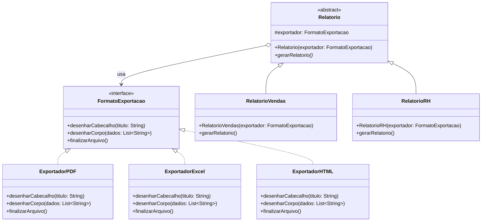
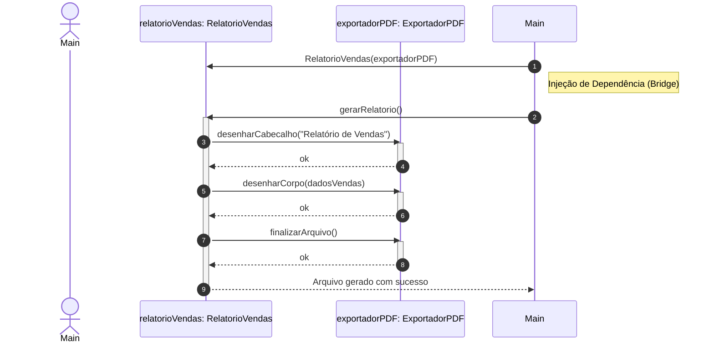

# Padrão Bridge: Aplicado ao caso de emissão de relatórios
> **Alunas:** Ana Beatriz Novais Pereira || Isabelle Gomes de Souza Andrade

Usamos o padrão Bridge, que faz parte do grupo de padrões estruturais, para solucionar o seguinte problema:

A equipe de engenharia de um sistema de inteligência de negócios TechFatec precisa expandir o módulo de relatórios. O sistema legado gera exclusivamente o "Relatório de Vendas" no formato "PDF". O novo requisito exige a inclusão do "Relatório de Desempenho de RH", estipulando que todos os relatórios (atuais e futuros) devem ser exportáveis para PDF, Excel (XLSX) e HTML. A diretriz arquitetural requer a aplicação do Padrão Bridge para prevenir a explosão de subclasses e aderir ao Princípio Aberto/Fechado do SOLID. 

---

Esse padrão se torna muito útil a partir do momento em que separamos o **"o que"** do **"como"**. 

A criação de relatórios é a nossa regra de negócio, a **parte abstrata**, onde podem surgir novas formatações de conteúdo. Já o formato em que o arquivo deve sair é a nossa **parte de implementação**. 

Com isso definido, elaboramos nosso diagrama de classes e de sequência para mapear visualmente a aplicação antes de codificar a solução.

---

## Diagrama de Classes

Este diagrama representa bem a separação entre a Abstração (nosso "o que") e a Implementação (nosso "como").

**Detalhes do Diagrama de Classes:**

* Lado da Abstração:

   -> Relatorio (Classe Abstrata): Mantém a referência protegida (exportador) para a interface de exportação.

   -> RelatorioVendas e RelatorioRH (Classes Concretas): Especializam a lógica de negócios de cada tipo de relatório.

* Lado da Implementação:

   -> FormatoExportacao (Interface): Define os métodos padrão de renderização.

   -> ExportadorPDF, ExportadorExcel e ExportadorHTML (Classes Concretas): Implementam a lógica específica de geração de arquivos para cada formato.

* Relacionamento Bridge: A Agregação (o-->) entre Relatório e FormatoExportacao forma a ponte, permitindo injetar qualquer exportador em tempo de execução.

---

## Diagrama de Sequência
O diagrama de sequência demonstra o fluxo de execução comportamental quando a classe cliente (Main) instancia um relatório de vendas, injeta um exportador PDF e solicita a geração.

**Detalhes do Fluxo de Execução:**

* **Instanciação**: O cliente instancia o exportador concreto (ExportadorPDF) e o passa como parâmetro para o construtor da classe refinada (RelatorioVendas).

* **Solicitação**: O cliente chama o método gerarRelatorio() na abstração.

* **Delegação (A Ponte em ação)**: O RelatorioVendas processa seus dados específicos e delega as chamadas de renderização (desenharCabecalho, desenharCorpo, finalizarArquivo) para o objeto exportadorPDF injetado, mantendo a regra de negócio desacoplada da tecnologia de arquivo.

---
    
## Resumo das Etapas Aplicadas (Log)
1º Separamos o "o que" do "como".

2º Criamos a interface de implementação, onde definimos os métodos usados por todos os formatos de exportação.

3º Criamos a classe abstrata base para a regra de negócio, incluindo nela o atributo tipado com a interface de implementação.

4º Conectamos via injeção no construtor da abstração a implementação desejada (é aqui que vemos a nossa Ponte ser estabelecida).

O próximo passo será a codificação em si.
